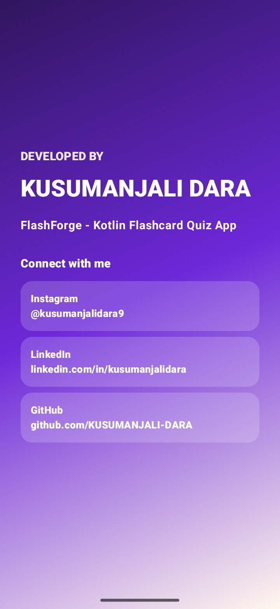
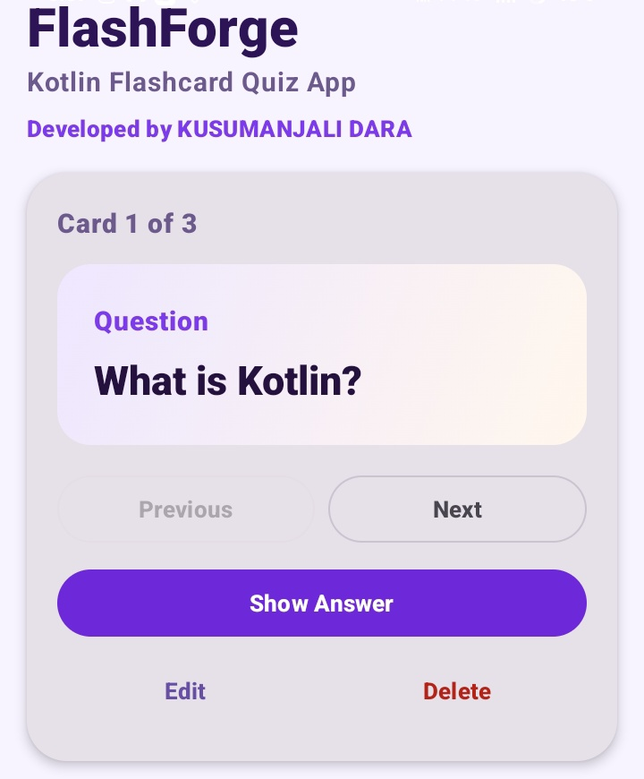
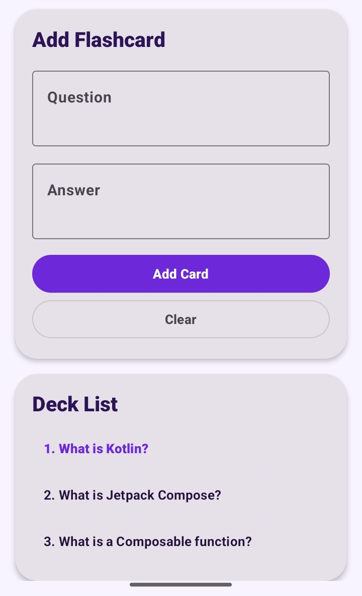

# CodeAlpha_Flashcard_Quiz_App

A native Android Flashcard Quiz App developed as part of my CodeAlpha internship.

## Developed By

**KUSUMANJALI DARA**

- LinkedIn: https://www.linkedin.com/in/kusumanjalidara/
- GitHub: https://github.com/KUSUMANJALI-DARA
- Instagram: https://www.instagram.com/kusumanjalidara9/

## Project Overview

FlashForge is a Kotlin-based Android application that helps users study using interactive flashcards. Users can view questions, reveal answers, navigate between cards, and manage their own flashcard deck.

## Screenshots

### Splash Screen

### Home Screen

### Add Flashcard Screen

## Features

- Splash screen with developer name and social links
- Question and answer flashcard display
- Show Answer / Hide Answer functionality
- Previous and Next card navigation
- Add new flashcards
- Edit existing flashcards
- Delete flashcards
- Deck list for quick card selection
- Scrollable mobile-friendly UI
- Local data storage using SharedPreferences

## Tech Stack

- Kotlin
- Jetpack Compose
- Material 3
- Android Studio
- SharedPreferences

## How To Run

1. Clone this repository.
2. Open the project in Android Studio.
3. Let Gradle sync complete.
4. Connect an Android phone or start an emulator.
5. Click Run.

## What I Learned

- Android app development using Kotlin
- UI design using Jetpack Compose
- Managing app state
- Creating reusable composable functions
- CRUD operations
- Local data storage using SharedPreferences
- Preparing a project for GitHub and LinkedIn

## Internship Task

This project was completed as part of the **CodeAlpha Internship Program**.
